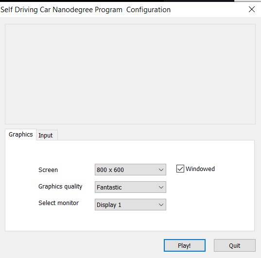
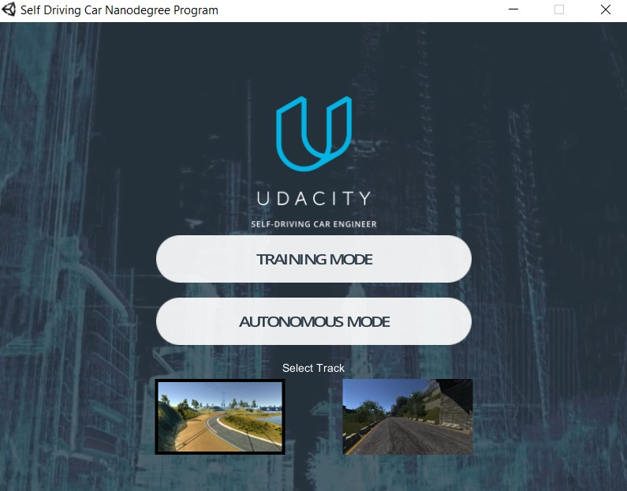
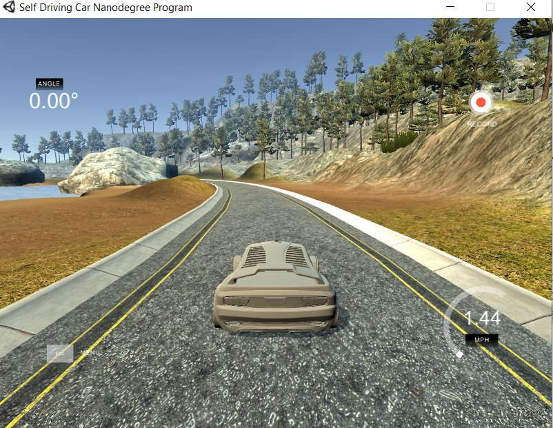

## Self-Driving-Car-with-Neural-Networks


First you should download the zip file, extract it and run the executable file.

Version 2, 2/07/17

[Linux](https://s3-us-west-1.amazonaws.com/udacity-selfdrivingcar/Term1-Sim/term1-simulator-linux.zip) [Mac](https://s3-us-west-1.amazonaws.com/udacity-selfdrivingcar/Term1-Sim/term1-simulator-mac.zip) [Windows](https://s3-us-west-1.amazonaws.com/udacity-selfdrivingcar/Term1-Sim/term1-simulator-windows.zip)

Version 1, 12/09/16

[Linux](https://d17h27t6h515a5.cloudfront.net/topher/2016/November/5831f0f7_simulator-linux/simulator-linux.zip) [Mac](https://d17h27t6h515a5.cloudfront.net/topher/2016/November/5831f290_simulator-macos/simulator-macos.zip) [Windows 32](https://d17h27t6h515a5.cloudfront.net/topher/2016/November/5831f4b6_simulator-windows-32/simulator-windows-32.zip) [Windows 64](https://d17h27t6h515a5.cloudfront.net/topher/2016/November/5831f3a4_simulator-windows-64/simulator-windows-64.zip)


### Unity Simulator User Instructions

1. Clone the repository to your local directory, please make sure to use [Git LFS](https://git-lfs.github.com/) to properly pull over large texture and model assets.
2. Install the free game making engine [Unity](https://unity3d.com/), if you dont already have it. Unity is necessary to load all the assets.When you open the application 







You select the training mode to generate your own data

and select the folder that you want to save your data.




After you created your data files  you should create your python environment

and install all the repositories needed

```
pip install eventlet
```


```
pip install python-engineio==3.13.2
```

```
pip install python-socketio==4.6.1
```

```
conda install -c conda-forge tensorflow

....
```


Create  your  Jupiter notebook:


